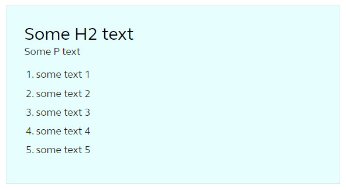
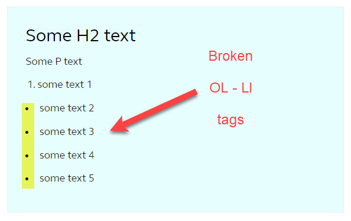

Design a data for your application isn't a tough task if you have to do it from scratch. But migration or conversion project, might have few limitations, in terms of modifying the data structure (or the response structure which is being served to the Angular application through API service).

I would like to share one of the use case, where the client didn't allow to modify the data response for particular section and we had to find a solution to render correct UI with the same.

Below response was coming from the backend service.

<small>(I know this data is not making sense having in a string-array format. But this is how it was coming through some tooling configuration (or CMS) in the existing developed system and as the old system was live for its customer, we were restricted modifying the same.)</small>

### JSON

```json
{
	"arrayKey": {
		"<div class=\"some-class\">",
		"<h2>Some H2 text</h2>",
		"<p>Some P text</p>",
		"<ol><li>some text 1</li>",
		"<li>some text 2</li>",
		"<li>some text 3</li>",
		"<li>some text 4</li>",
		"<li>some text 5</li></ol></div>"
	}
}
```

### UI Expectation



#### Suggested Solution (which was rejected due to the reason mentioned above)

```json
{
	"arrayKey": {
		"<div class=\"some-class\"><h2>Some H2 text</h2><p>Some P text</p><ol><li>some text 1</li><li>some text 2</li><li>some text 3</li><li>some text 4</li><li>some text 5</li></ol><div>"
	}
}
```

If we try with above-suggested solution then we would get the exact output as in the above image.

### HTML

Below is the simple HTML rendering the UI.

```html
<div [innerHtml]="data?.arrayKey"></div>
```

Now let's deal with the strings-array format to render the same UI. Below was the UI we were getting.

We tried to achive that by adding a for-loop logic in TS file. But somehow due to the `OL` tag, it was breaking the numbering sequence due to the `DIV` placeholder.

### Another HTML

```html
<div *ngFor="let item of data?.arrayKey" [innerHTML]="item"></div>
```

### And the Broken UI



## The Fix

To fix this broken UI we did a trick with pure JavaScript - `join()`.

### Working HTML

Below is the simple HTML rendering the UI.

```html
<div [innerHtml]="data?.arrayKey.join('')"></div>
```

Hopefully, this soulution should be helpful if you are not deep into the JavaScript.

<small>Do comment if you have other or similar solution for such scenario.

Happy coding :)
</small>